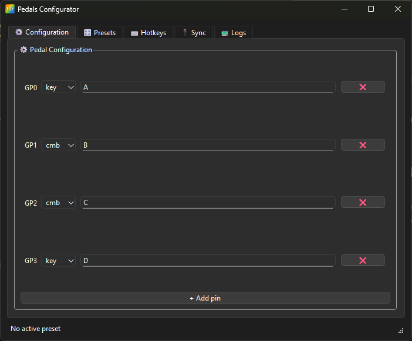

# 🎛️ Pedals Configurator

A desktop application for configuring custom foot pedals based on **Raspberry Pi Pico** running **CircuitPython**.  
It allows you to map pedal GPIO pins to keyboard actions (single keys or key combos), manage presets,  
and send configurations directly to the Pico as `config.json`.

Built with **Python + PySide6 (Qt)** and sprinkled with sarcasm and too much love for automation.

---

## 🚀 Features

- 🦶 **Pedal Configuration GUI**  
  Assign key actions to individual Pico GPIO pins with a simple interface.

- 🎚️ **Presets System**  
  Save, load, and manage pedal profiles.  
  Auto-save and auto-sync with Pico’s `config.json`.

- ⌨️ **Global Hotkeys**  
  Switch presets on the fly using system-wide keyboard shortcuts.

- 🔌 **Pico Integration**  
  Automatically detects your connected `CIRCUITPY` drive and syncs the configuration file.

- 🪟 **System Tray Support**  
  Runs quietly in the background. Minimize to tray, right-click to show, save, or quit.

---

## 🧰 Tech Stack

| Component | Purpose |
|------------|----------|
| **PySide6 (Qt)** | GUI & Tray |
| **psutil** | Detecting CIRCUITPY drive |
| **keyboard** | Global hotkeys |
| **pyserial** | Reading data from Pico serial port |
| **Pillow** | Icon generation (optional) |
| **darkdetect** | Theme-based icon switching (optional) |

---

## 🪄 Installation

Clone the repository and install dependencies:

```bash
git clone https://github.com/YOUR_USERNAME/pedals-configurator.git
cd pedals-configurator
pip install -r requirements.txt
```
Run the application:

```bash
python main.py
```

---

## ⚙️ Configuration Files

| File                     | Purpose                          |
| ------------------------ | -------------------------------- |
| `config/config.json`     | Main pedal mapping configuration |
| `config/hotkeys.json`    | Global hotkey → preset bindings  |
| `presets/*.json`         | User-defined pedal profiles      |
| `icons/pedals.ico`       | The mighty rainbow pedal icon    |

---

## 💾 Syncing with Pico

When a CIRCUITPY device is connected:

- The app detects it automatically,
- Saves config.json directly to the Pico drive,
- CircuitPython loads it on startup.

Manual sync available under the 🔌 "Sync" tab.

---

## 🧱 Build an executable (Windows)
You can create a standalone .exe file using PyInstaller:

```bash
pyinstaller --onefile --noconsole --icon=icons/pedals_turbo.ico main.py
```
The generated .exe will include the custom icon and run without a console window.

---

## 📂 Pedals Configurator – Project Overview

### 🧠 Core Application
| File | Description |
|------|--------------|
| **`main.py`** | Application entry point. Initializes Qt (`QApplication`), sets global app icon, and launches the main window (`PedalsApp`). |
| **`gui/main_window.py`** | Main GUI class — handles all tabs, the serial connection, hotkeys, Pico syncing, status bar, and tray icon behavior. |

---

### 🎛️ GUI Tabs
| File | Description |
|------|--------------|
| **`gui/tabs/config_tab.py`** | “Configuration” tab. Lets the user assign keyboard actions to each Pico GPIO pin. Dynamically adds/removes pin rows. |
| **`gui/tabs/presets_tab.py`** | “Presets” tab. Manage configuration profiles — load, save, delete, and apply presets. |
| **`gui/tabs/hotkeys_tab.py`** | “Hotkeys” tab. Lets users map global keyboard shortcuts to specific presets. Handles validation and duplicate prevention. |
| **`gui/tabs/sync_tab.py`** | “Sync” tab. Manually upload/download the config file between the local machine and Pico (`CIRCUITPY`). |
| **`gui/tabs/logs_tab.py`** | “Logs” tab. Displays serial output from the Pico and app logs. Also has buttons to reload or save config. |

---

### 🧩 GUI Widgets
| File | Description |
|------|--------------|
| **`gui/widgets/key_capture_lineedit.py`** | Custom text input field for capturing key combinations. Supports translation between Qt/Windows names and HID key strings (used in `config.json`). |

---

### ⚙️ Configuration & Sync
| File | Description |
|------|--------------|
| **`config/config_manager.py`** | Handles loading and saving of the local `config.json` with atomic writes. Provides a default configuration. |
| **`config/pico_sync.py`** | Detects the `CIRCUITPY` drive and synchronizes the config file to and from the connected Pico device. |
| **`config/keycode_map.py`** | Maps GUI key names (`CTRL`, `ALT`, etc.) to HID keycodes used by `adafruit_hid.keycode`. Also supports reverse translation for display. |
| **`config/preset_manager.py`** | Manages preset files — lists, loads, saves, and deletes JSON-based preset configs. |

---

### 🧠 Hotkey & Serial Logic
| File | Description |
|------|--------------|
| **`hotkeys/hotkey_manager.py`** | Manages global system-wide hotkeys using the `keyboard` library. Runs in its own thread and emits preset change signals. |
| **`pico_serial/serial_reader.py`** | Background thread for continuously reading data from the Pico’s serial output. Queues lines for safe access from the GUI thread. |

---

### 🖼️ Icons
| File | Description |
|------|--------------|
| **`icons/pedals.svg`** | Main SVG icon (rainbow pedals). Used for generating app icon and tray icon. |
| **`icons/pedals.ico`** | Windows ICO version of the icon — used in the taskbar and when packaging the app. |

---

### 📦 Other Important Files
| File | Description |
|------|--------------|
| **`requirements.txt`** | Lists required Python dependencies (PySide6, psutil, keyboard, pyserial, Pillow, etc.). |
| **`.gitignore`** | Ignores environment folders (`venv/`), IDE configs (`.idea/`), build artifacts, and temporary files. |
| **`README.md`** | Project overview, installation instructions, and usage guide. |

---

## 🧑‍💻 Development Notes
- Works best on Windows 10/11 (tested).
- Run as Administrator if global hotkeys don’t register.
- for Pico → CircuitPython firmware: https://circuitpython.org/board/raspberry_pi_pico/

## 📸 Screenshots


## 👨‍💼 Author
Built by Bartosz Połok

because sometimes hands are not enough.

> “It’s not automation until you can trigger it with your foot.”
>
>— Someone who definitely had too many pedals connected

## 📜 License
MIT License – do whatever you want, but don’t blame me if your foot triggers a system shutdown.