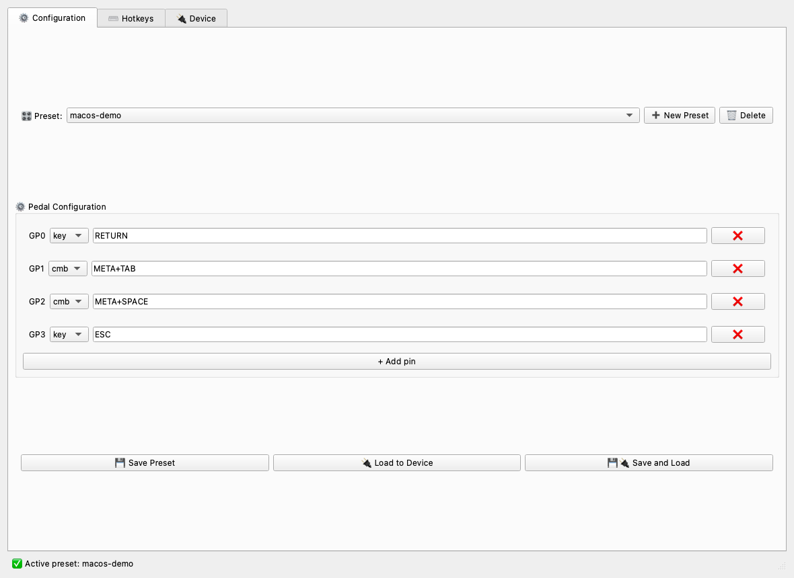

# Pedals Configurator

Desktop app and ready-to-copy firmware for a custom foot pedal built on Raspberry Pi Pico and CircuitPython.

The project lets you:

- configure Pico GPIO pins from a desktop GUI
- assign single keys, keyboard shortcuts, and media controls
- save and switch presets
- sync `config.json` directly to the `CIRCUITPY` drive
- copy a complete offline firmware bundle to a fresh Pico without downloading extra libraries

## Screenshot



## What Is In This Repo

- [`gui/`](gui): PySide6 desktop interface
- [`config/`](config): config loading, validation, translation, Pico sync
- [`pico_serial/`](pico_serial): serial log reader
- [`hotkeys/`](hotkeys): global preset hotkeys
- [`presets/`](presets): sample public presets
- [`firmware/`](firmware): complete CircuitPython bundle with `code.py`, `config.json`, and bundled `adafruit_hid`

## Features

- `key`: one keyboard key per pin
- `cmb`: multi-key shortcut per pin
- `ccc`: media controls such as play/pause, mute, next track, and volume
- immediate validation in the GUI for invalid mappings
- preset save/load workflow
- serial connection and device config import
- offline firmware bundle for Raspberry Pi Pico

## Desktop App Setup

```bash
git clone git@github.com:xpatisonx/pedals_configurator.git
cd pedals_configurator
python -m venv .venv
source .venv/bin/activate
pip install -r requirements.txt
python main.py
```

On Windows, activate the virtual environment with:

```powershell
.venv\Scripts\activate
```

Ready-made desktop builds are published in GitHub Releases:

- `PedalsConfigurator-windows.zip`
- `PedalsConfigurator-macos.zip`
- `PedalsConfigurator-linux.zip`

Direct download links:

- [Windows](https://github.com/xpatisonx/pedals_configurator/releases/latest/download/PedalsConfigurator-windows.zip)
- [macOS](https://github.com/xpatisonx/pedals_configurator/releases/latest/download/PedalsConfigurator-macos.zip)
- [Linux](https://github.com/xpatisonx/pedals_configurator/releases/latest/download/PedalsConfigurator-linux.zip)
- [All releases](https://github.com/xpatisonx/pedals_configurator/releases)

## Firmware Setup

The [`firmware/`](firmware) directory is self-contained.

It already includes:

- `code.py`
- `config.json`
- `lib/adafruit_hid/*.mpy`

To install on a Pico:

1. Flash CircuitPython to a Raspberry Pi Pico.
2. Connect the board so it appears as `CIRCUITPY`.
3. Copy everything from [`firmware/`](firmware) onto the drive.
4. Wait for CircuitPython to reload.

No extra library download is required.

## Example Files

- [`config/config.example.json`](config/config.example.json): example desktop config
- [`config/hotkeys.example.json`](config/hotkeys.example.json): example preset hotkeys
- [`firmware/config.json`](firmware/config.json): ready-to-test firmware mapping

The bundled firmware demo mapping is:

- `GP0` -> `UP_ARROW`
- `GP1` -> `DOWN_ARROW`
- `GP2` -> `GUI + SPACE`
- `GP3` -> `PLAY_PAUSE`

## Sample Presets

- [`presets/navigation.json`](presets/navigation.json)
- [`presets/macos-demo.json`](presets/macos-demo.json)
- [`presets/media-controls.json`](presets/media-controls.json)
- [`presets/typing-demo.json`](presets/typing-demo.json)

## Notes

- Global hotkeys may require extra permissions on macOS.
- The app ignores local user config files like `config/config.json` and `config/hotkeys.json`; example versions are included instead.
- `firmware/boot_out.txt` is intentionally excluded because it is generated by the specific board at runtime.

## License

[MIT](LICENSE)
